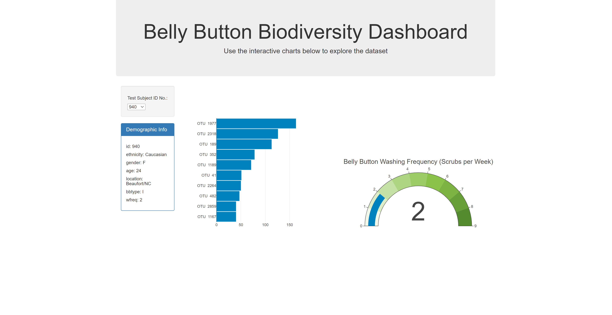
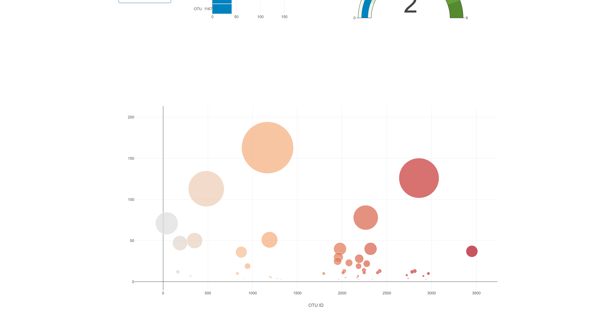

# plotly-challenge
**This is an interactive dashboard to explore the Belly Button Biodiversity dataset, which catalogs the microbes that colonize human navels.**
## Link to Deployed Dashboard
* https://tkuar.github.io/plotly-challenge/
### Example Dashboard
**Top**

**Bottom**

### Resources
* https://www.w3schools.com/tags/ev_onchange.asp
* https://plotly.com/javascript/

